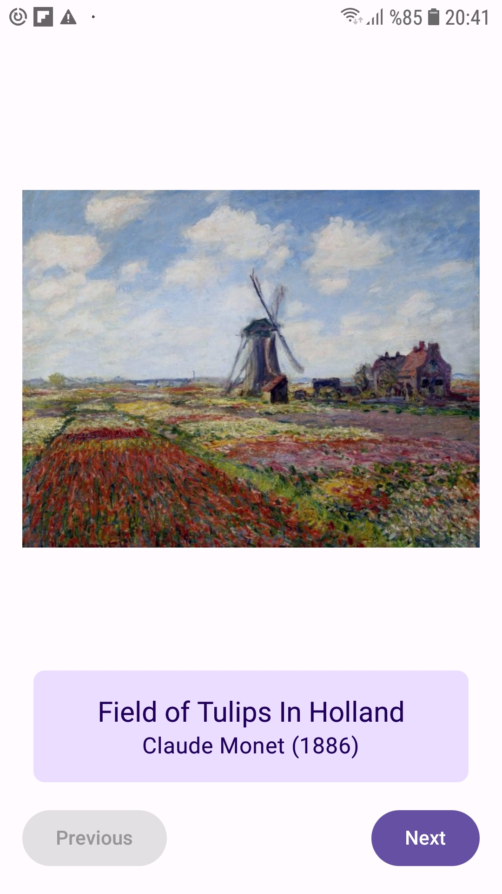

# ArtSpace App 🎨

ArtSpace App is an elegant Jetpack Compose-based application that showcases artwork along with details such as the title and artist. The app allows users to navigate through different artworks using intuitive "Previous" and "Next" buttons.

## ✨ Features
- **Image Display:** Displays artwork images with rounded corners and responsive scaling.
- **Artwork Details:** Shows title and artist name styled with `MaterialTheme` colors.
- **Navigation:** Navigate through different artworks with "Previous" and "Next" buttons.
- **State Management:** Utilizes state to dynamically update artwork and details.
- **Jetpack Compose:** Built entirely with modern Compose APIs for clean and concise UI.

---

## 🛠️ Technologies Used
- **Kotlin**: For Android application development.
- **Jetpack Compose**: For building declarative UI.
- **Material Design 3**: For theme and UI consistency.

---

## 🖼️ Screenshot
Below is a small preview of the app in action:



---

## 🚀 Getting Started
Follow these steps to run the app locally:

1. Clone this repository:
   ```bash
   git clone https://github.com/YourUsername/ArtSpaceApp.git
2. Open the project in Android Studio.
3. Sync Gradle and install the required dependencies.
4. Run the app on an emulator or physical device.

## 🌟 Future Improvements
- Add more artwork images and details.
- Implement a "Favorites" feature to save favorite artworks.
- Include animations for transitions between artworks.
- Support multi-language (localization)
